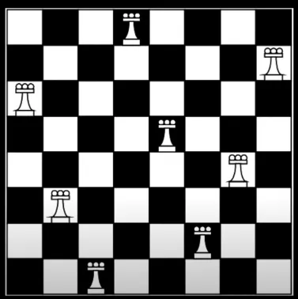

## BackTracking 이란?

해를 찾는 도중 해가 아니어서 막히면, 되돌아가서 다시 해를 찾아가는 기법

### 기본 형태

```js
function recursive() {
	if 종료 조건을 만족한다면 {
		처리;
}
for 자식 노드를 하나씩 확인하며 {
	if 임의의 조건을 만족한다면 {
		자식 노드 방문 처리;
		재귀 함수 recursive() 호출;
		자식 노드 방문 처리 해제;
		}
	}
}
```

[백트래킹 이해하기](https://kang-james.tistory.com/entry/%EC%95%8C%EA%B3%A0%EB%A6%AC%EC%A6%98-%EB%B0%B1%ED%8A%B8%EB%9E%98%ED%82%B9backtracking-%EC%95%8C%EC%95%84%EB%B3%B4%EA%B8%B0-N-Queen-%EB%AC%B8%EC%A0%9C-%ED%92%80%EC%9D%B4)

### 문제 예시

#### N-Queen

보드판에서 여왕말의 경로가 겹치지 않는 경우의 수 구하기 </br>
(여왕말은 가로, 세로, 대각선 모두 이동 가능)



#### 풀이 1

```js
function solveNQueens(n) {
  let board = Array(n)
    .fill()
    .map(() => Array(n).fill(false)); // 체스판
  let solutions = []; // 배치할 수 있는 해결책

  // 위치 검증
  function isValid(row, col) {
    for (let i = 0; i < row; i++) {
      // 세로
      if (board[i][col]) {
        return false;
      }
    }

    for (let i = row, j = col; i >= 0 && j >= 0; i--, j--) {
      // 대각선
      if (board[i][j]) return false;
    }

    for (let i = row, j = col; i >= 0 && j < n; i--, j++) {
      // 반대 대각선
      if (board[i][j]) return false;
    }

    return true;
  }

  // 퀸 배치
  function placeQueen(row) {
    if (row === n) {
      solutions.push(
        board.map((row) => row.map((col) => (col ? 'Q' : '.')).join(''))
      );
      return;
    }

    // col: 열 -> 각 행의 요소
    for (let col = 0; col < n; col++) {
      // 가로
      if (isValid(row, col)) {
        board[row][col] = true; // 퀸 하나 배치
        placeQueen(row + 1); // 다음 행에 대해 검사
        // 퀸 하나를 배치하고 다음 행 검사에서 문제가 생기면 아래 코드가 실행된다.
        // 문제 === false -> 재귀 실행X -> 퀸을 놓을 수 없음 -> 근데 위에서 true로 설정했으니까 다시 false로 되돌려야 함
        board[row][col] = false; // 놓았던 퀸을 되돌림 -> 백트래킹
      }
    }
  }

  placeQueen(0);
  return solutions.length;
}

console.log(solveNQueens(8));
```

> 위 풀이로 제출할 경우 메모리 초과 뜰 수 있음

[참고 사이트](https://www.youtube.com/watch?v=yEZOwnsme3A&t=182s)

---

#### 풀이 2

```js
// 가능한 노드 여부
// 1) 같은 행에 있는지 확인: x1 === x2 / 같은 열에 있는지 확인: y1 === y2
// 2) 대각선에 있는지 확인: abs(x1 - x2) === bas(y1 - y2)
const n = 8;
let queens = []; // 현재 체스판에 놓인 퀸(queen)의 위치 정보들

function possible(x, y) {
  // (x, y) 위치에 퀸을 놓을 수 있는지 확인
  for (let [a, b] of queens) {
    // 현재까지 놓았던 모든 퀸(queen)의 위치를 하나씩 확인하며
    if (a == x || b == y) return false; // 행이나 열이 같다면 놓을 수 없음
    if (Math.abs(a - x) == Math.abs(b - y)) return false; // 대각선에 위치한 경우 놓을 수 없음
  }
  return true;
}

let cnt = 0;
function dfs(row) {
  if (row == n) cnt += 1; // 퀸(queen)을 N개 배치할 수 있는 경우 카운트
  for (let i = 0; i < n; i++) {
    // 현재 행(row)에 존재하는 열을 하나씩 확인하며
    if (!possible(row, i)) continue; // 현재 위치에 놓을 수 없다면 무시 (아래 코드 실행X)
    queens.push([row, i]); // 현재 위치에 퀸을 놓기
    dfs(row + 1); // 재귀 함수 호출 -> 다음 줄 탐색
    queens.pop(); // ⭐백트래킹 -> 현재 위치에서 퀸을 제거하기
    // 1) 성공시 마지막 퀸을 제거하고 다른 경우의 수 탐색
    // 2) 실패시 잘못 놓여진 최근(마지막) 퀸 제거 후 다시 탐색색
  }
}

dfs(0);
console.log(cnt);
```

[참고사이트](https://velog.io/@ceusun0815/JavaScript-%EB%B0%B1%ED%8A%B8%EB%9E%98%ED%82%B9-N-Queen-%EB%AC%B8%EC%A0%9C)
